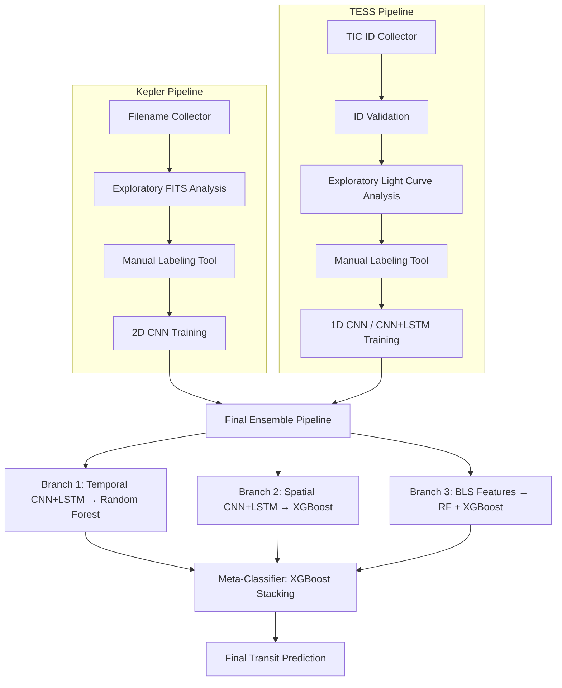

# 🪐 Exoplanet Transit Detection Pipeline

**An end-to-end machine learning system for detecting exoplanet transits from Kepler and TESS mission data — combining classical astronomical signal processing with deep learning and ensemble stacking.**

---

## 📖 Overview

This repository implements a complete, multi-stage pipeline for identifying exoplanet transit signals in stellar photometry data from two NASA missions: **Kepler** and **TESS** (Transiting Exoplanet Survey Satellite). Rather than relying on a single model or data representation, the pipeline builds two parallel, mission-specific processing tracks — each covering data acquisition, signal preprocessing, human-in-the-loop labeling, and neural network training — before merging their outputs into a final **stacked ensemble classifier** that combines temporal, spatial, and classical transit-detection signals into a single prediction.

The system is designed around a core astrophysical principle: a transiting exoplanet produces a small, periodic, box-shaped dip in a star's observed brightness as the planet passes in front of it. Detecting this signal reliably requires filtering out instrumental noise, stellar variability, and cosmic-ray artifacts — which this pipeline addresses through a combination of statistical detrending, quality filtering, and multiple independent modeling approaches.

---

## ✨ Key Features

- **Dual-mission support** — independent, mirrored pipelines for Kepler target pixel files and TESS light curves
- **Multiple data representations** — 1D flux time-series, 2D pixel imagery, and classical Box Least Squares (BLS) transit statistics
- **Human-in-the-loop labeling tools** — interactive classification workflows with progress tracking, resumability, and rich diagnostic visualizations
- **Deep learning feature extraction** — CNN, CNN+LSTM, and TimeDistributed Conv2D+LSTM architectures for temporal and spatial pattern recognition
- **Classical ML integration** — Random Forest and XGBoost classifiers trained on learned neural embeddings and hand-engineered BLS features
- **Stacked ensemble architecture** — a meta-classifier that learns to weigh and combine predictions from all upstream models
- **Reproducibility built in** — checkpointing, resumable batch processing, and saved intermediate artifacts at every stage

---

## 🏗️ Pipeline Architecture



---

## 📂 Repository Structure

```
.
├── Kepler Pipeline (01_*)
│   ├── 01_kepler_files_saver.ipynb     # Collects and stores target filenames
│   ├── 01_check_kepler_files.ipynb     # Exploratory FITS parsing & detrending prototype
│   ├── 01_dataset_1.ipynb              # Interactive transit labeling tool
│   └── 01_dd_CNN_LSTM.ipynb            # 2D CNN training on pixel imagery
│
├── TESS Pipeline (02_*)
│   ├── 02_id_up.ipynb                  # Collects and stores TIC IDs
│   ├── 02_id_check.ipynb               # Validates IDs against available TESS data
│   ├── 02_check_id.ipynb               # Exploratory light curve analysis prototype
│   ├── 02_dataset_2.ipynb              # Interactive transit labeling tool (OOP)
│   └── 02_d_CNN_LSTM.ipynb             # 1D CNN / CNN+LSTM training
│
└── Final Ensemble
    └── phase_3.ipynb                   # Multi-branch stacked ensemble pipeline
```

---

## 🔬 Pipeline Details

### Kepler Pipeline

| Notebook | Purpose |
|---|---|
| `1.1_kepler_files_saver.ipynb` | Interactive tool for building and maintaining a registry of Kepler target pixel file (`.fits.gz`) names to process |
| `1.2_check_kepler_files.ipynb` | Exploratory notebook for parsing FITS files, applying aperture photometry, quality filtering, and prototyping the detrending approach used later at scale |
| `1.3_dataset_1.ipynb` | Batch-processes all registered files and presents each one's light curve for manual classification (Positive / Negative / Uncertain / Skip), producing labeled training data |
| `1.4_dd_CNN_LSTM.ipynb` | Converts labeled FITS files into fixed-size images and trains a deep 2D convolutional neural network with k-fold cross-validation and data augmentation |

### TESS Pipeline

| Notebook | Purpose |
|---|---|
| `2.1_id_up.ipynb` | Interactive tool for collecting and storing TESS Input Catalog (TIC) IDs |
| `2.2_id_check.ipynb` | Validates each TIC ID by attempting a full download-and-preprocess cycle, sorting IDs into successful and failed lists with resumable batch processing |
| `2.3_check_id.ipynb` | Exploratory single-target analysis prototyping detrending and zoomed-transit visualization using `lightkurve` |
| `2.4_dataset_2.ipynb` | Object-oriented labeling pipeline with retry logic, automatic transit-centering, and rich multi-panel diagnostic plots |
| `2.5_d_CNN_LSTM.ipynb` | Trains a 1D CNN or a genuine CNN+LSTM hybrid on resampled flux sequences, with synthetic data generation as a fallback for failed downloads |

### Final Ensemble — `phase_3.ipynb`

The capstone notebook that merges the outputs of both pipelines into a unified, three-branch stacked ensemble:

- **Branch 1 (Temporal):** A Conv1D + LSTM backbone extracts features from flux sequences; a Random Forest makes the final prediction from those features.
- **Branch 2 (Spatial):** A TimeDistributed Conv2D + LSTM backbone extracts features from sequences of pixel images; an XGBoost classifier makes the final prediction.
- **Branch 3 (BLS):** Classical Box Least Squares transit statistics (period, duration, depth, signal-to-noise, and more) are computed directly from the flux data and fed into both a Random Forest and an XGBoost model, whose outputs are averaged.
- **Meta-Classifier:** An XGBoost stacking model learns how to combine the three branches' predictions into a single, final transit probability.

---

## ⚙️ Requirements

- Python 3.10+
- `numpy`, `pandas`, `scipy`, `scikit-learn`
- `tensorflow` / `keras`
- `xgboost`
- `astropy`
- `lightkurve`
- `scikit-image`
- `matplotlib`, `seaborn`
- `joblib`

Install core dependencies with:

```bash
pip install numpy pandas scipy scikit-learn tensorflow xgboost astropy lightkurve scikit-image matplotlib seaborn joblib openpyxl
```

---

## 🚀 Getting Started

Run the notebooks in sequence within each pipeline, then feed both pipelines' outputs into the final ensemble:

**1. Kepler track:**
```
1.1_kepler_files_saver.ipynb → 1.2_check_kepler_files.ipynb → 1.3_dataset_1.ipynb → 1.4_dd_CNN_LSTM.ipynb
```

**2. TESS track:**
```
2.1_id_up.ipynb → 2.2_id_check.ipynb → 2.3_check_id.ipynb → 2.4_dataset_2.ipynb → 2.5_d_CNN_LSTM.ipynb
```

**3. Final ensemble:**
```
phase_3.ipynb
```

Each stage saves its outputs (CSV registries, labeled datasets, `.npy` arrays, trained models) to disk, so the pipeline can be paused and resumed at any point.

---

## 📊 Output Artifacts

| File | Produced By | Description |
|---|---|---|
| `names.fitz.gz.csv`, `new_tess_id.csv` | Filename/ID collectors | Registries of targets to process |
| `Positive_File.csv`, `Negative_File.csv`, `Uncertain_File.csv`, `Skipped_file.csv` | Kepler labeling tool | Manually classified Kepler targets |
| `Positive_Transit.csv`, `Negative_Transit.csv`, `Uncertain_Transit.csv`, `Skipped_Transit.csv` | TESS labeling tool | Manually classified TESS targets |
| `2d_X.npy`, `2d_y.npy` | Kepler CNN training | Preprocessed image tensors and labels |
| `1d_X_data.npy`, `1d_y_labels.npy` | TESS CNN training | Preprocessed flux sequences and labels |
| `best_2D-trained_model.keras`, `best_1d_trained_model.keras` | CNN training / ensemble | Trained backbone models |
| `branch1_rf.joblib`, `branch2_xgb.joblib`, `branch3_rf.joblib`, `branch3_xgb.joblib` | Ensemble pipeline | Branch-level classical classifiers |
| `bls_scaler.joblib` | Ensemble pipeline | Fitted scaler for BLS features |
| `meta_xgb.joblib` | Ensemble pipeline | Final stacking meta-classifier |

---

## 🔭 Data Sources

This project processes publicly available data from:

- **[Kepler Mission](https://www.nasa.gov/mission_pages/kepler/main/index.html)** — NASA's original exoplanet-hunting space telescope
- **[TESS Mission](https://tess.mit.edu/)** — NASA's Transiting Exoplanet Survey Satellite
- **[MAST Archive](https://archive.stsci.edu/)** — accessed via the `lightkurve` and `astropy` Python packages

---

## 🛠️ Known Limitations

- Sample alignment between the 1D (TESS-derived) and 2D (Kepler-derived) datasets in the final ensemble assumes matching order and length, which is not independently verified.
- The BLS `odd_even_ratio` feature is currently a fixed placeholder rather than a computed value, and does not yet perform genuine odd/even transit-depth comparison for eclipsing binary rejection.
- The meta-classifier is currently trained and validated on the same held-out split, which may lead to an optimistic performance estimate.

---

## 🙏 Acknowledgments

Built using data and tools provided by NASA's Kepler and TESS missions, the Mikulski Archive for Space Telescopes (MAST), and the open-source `astropy` and `lightkurve` communities.
